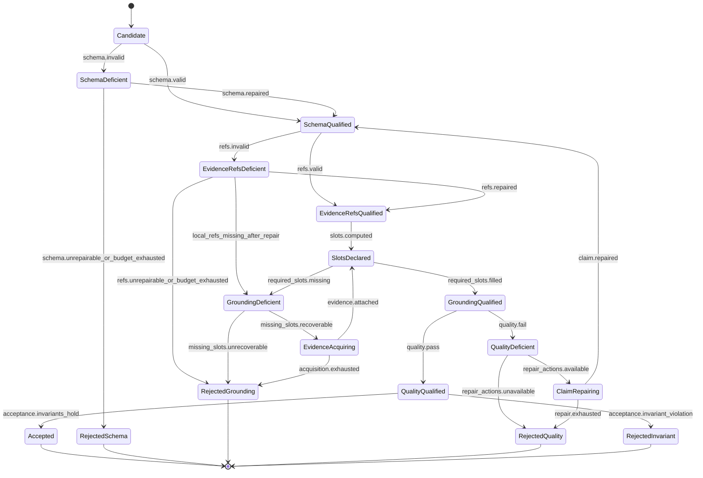

# S3 Claim Lifecycle Statechart

> Status: **draft**
> Scope: lifecycle of one vulnerability claim inside a `deep-analyze` TaskRun
> Parent: [[wiki/canon/specs/s3-claim-evidence-state-machine/readme|S3 Claim-Evidence State Machine]]

This page defines the condition states for a single claim. A claim is not just a JSON object returned by an LLM; it is a candidate assertion that must accumulate valid schema, local evidence, grounding slots, and quality status before it can be accepted.

---

## 1. Claim identity

A claim should have a stable internal identity for the duration of one TaskRun.

Suggested identity fields:

- `claimId` — S3-generated stable ID such as `claim-0` or hash-based ID;
- `family` — generic vulnerability family such as `command_injection`, `buffer_bounds`, `null_deref`, `integer_overflow`, `path_traversal`, `lifetime`, `dependency_vulnerability`;
- `cweCandidates[]` — optional CWE identifiers, knowledge context only unless tied to SAST metadata;
- `primaryLocation` — target file/line/symbol when available;
- `primarySink` — sink/dangerous API/write/deref/file op when available;
- `supportingEvidenceRefs[]` — local/derived-local refs only in v1;
- `requiredSlots[]`, `filledSlots[]`, `missingSlots[]`.

Claim identity should survive repair attempts unless repair intentionally rejects/merges/splits the claim.

---

## 2. Claim lifecycle statechart

---

## 3. State definitions

| State | Meaning |
|---|---|
| `Candidate` | A proposed claim exists but has not yet passed schema validation. |
| `SchemaQualified` | Required claim fields exist with valid types and minimally meaningful content. |
| `SchemaDeficient` | The claim is malformed, missing fields, or has wrong types. |
| `EvidenceRefsQualified` | Claim refs are present in the evidence ledger and allowed for claim-level support. |
| `EvidenceRefsDeficient` | Claim refs are hallucinated, unauthorized, wrong-role, or insufficient for claim support. |
| `SlotsDeclared` | Required evidence slots have been computed from the claim family, sink, mode, and SAST-backed status. |
| `GroundingQualified` | Required local evidence slots are filled. |
| `GroundingDeficient` | Required local evidence slots are missing. |
| `EvidenceAcquiring` | Targeted slot acquisition is in progress or planned. |
| `QualityQualified` | Claim passes deep-analysis quality gate. |
| `QualityDeficient` | Claim failed quality gate with one or more failed rubric items. |
| `ClaimRepairing` | A bounded claim repair action is being applied. |
| `Accepted` | Claim may appear in final `result.claims[]`. |
| `Rejected*` | Claim is excluded from final accepted claims and must leave audit diagnostics that can feed `no_accepted_claims` or `inconclusive` result outcomes. |

---

## 4. Acceptance invariants

A claim may enter `Accepted` only if all of the following hold:

1. schema is valid;
2. claim-level refs are allowed local or derived-from-local refs;
3. required local slots for the claim family are filled;
4. knowledge-only support is not used as local grounding;
5. quality gate passes or is explicitly waived by a documented non-product/evaluation mode;
6. confidence/severity/human-review metadata is present at the response level;
7. any operational limitations are caveated rather than used as evidence of vulnerability absence/presence.

---

## 5. Claim canonicalization

LLM outputs may contain zero, duplicate, overlapping, or overly granular claims. S3 should canonicalize before final acceptance.

### Candidate merge keys

Possible merge keys:

- same primary sink and source location;
- same SAST finding ref;
- same source slice and vulnerability family;
- same dependency/CVE/library tuple;
- same caller-chain endpoint.

### Representative selection

When multiple candidate claims describe the same local issue, prefer the candidate with:

1. valid local refs;
2. more filled required slots;
3. stronger source/sink/caller specificity;
4. fewer unsupported speculative statements;
5. better quality score.

### Rejection is not failure by itself

Rejecting weak/duplicate claims is normal. If no acceptable claim remains after RecoveryTriage, a valid-input/live-runtime TaskRun should return `completed` with `analysisOutcome=no_accepted_claims` or `analysisOutcome=inconclusive`. Evaluation objectives may mark that result as non-clean, but they do not turn it into task failure. Task failure is reserved for invalid input, unavailable runtime/dependency, hard timeout/cancellation, unsafe/out-of-authority request, or internal envelope-assembly failure.

---

## 6. Rejected claims are result-outcome inputs

Rejected claims are not task failures by themselves. If all candidates are rejected after RecoveryTriage, S3 should normally produce `completed` with `analysisOutcome=no_accepted_claims` or `analysisOutcome=inconclusive`, provided caller input and runtime dependencies are valid and a schema-valid envelope can be assembled.

---

## 7. Relation to TaskRun

Claim states roll up to TaskRun states:

| Claim condition | TaskRun implication |
|---|---|
| any repairable `SchemaDeficient` | TaskRun may enter `SchemaDeficient` / `RetryPlanning` |
| any repairable `EvidenceRefsDeficient` | TaskRun may enter `EvidenceRefsDeficient` |
| all useful claims `RejectedGrounding` | TaskRun should enter outcome classification and usually return `completed` with `analysisOutcome=no_accepted_claims` or `inconclusive` if input/runtime are valid |
| at least one `GroundingDeficient` with recoverable slots | TaskRun enters `EvidenceAcquisitionPlanned` |
| at least one `QualityDeficient` with repair actions | TaskRun enters `ClaimRepairPlanned` |
| at least one `Accepted` and response invariants hold | TaskRun may enter `ResponseCandidate` |

---

## 8. Open decisions

1. Should S3 require exactly one accepted representative claim for certain evaluation fixtures, or should that stay outside the generic state machine?
2. Should `SchemaQualified -> EvidenceRefsQualified -> SlotsDeclared` be represented as separate runtime states, or only as validation phases in code?
3. How should S3 expose rejected claims in audit without leaking noisy LLM speculation into user-facing output?
4. Should non-SAST-backed claims be accepted in product mode, paper/evaluation mode, both, or neither?

<!-- S3-WP0A-20260427:START -->
## 2026-04-27 WP-0a public placement decision: accepted-only claims

Open decision #3 is resolved for the current implementation pass by **Option A**:

- `result.claims[]` is an accepted-final-claim surface only.
- `Candidate`, `SchemaDeficient`, `EvidenceRefsDeficient`, `GroundingDeficient`, `QualityDeficient`, `EvidenceAcquiring`, and all `Rejected*` states are excluded from `result.claims[]`.
- Non-accepted lifecycle states appear in bounded `result.claimDiagnostics[]` plus audit/recovery records.
- A rejected or under-evidenced candidate contributes to `analysisOutcome="no_accepted_claims"` or `analysisOutcome="inconclusive"` when no accepted claim remains, but it does not become a task-level failure under valid-input/live-runtime conditions.

This keeps developer-facing final findings clean while preserving enough diagnostic detail for evidence consumption, repair planning, and hotN/evaluation grouping.

2026-04-28 Pass-A refinement:
- `Rejected` is a reachable lifecycle status when a candidate cites at least one ref and all cited refs are invalid/missing.
- Mixed valid/invalid refs remain `UnderEvidenced`, not rejected.
- `NeedsHumanReview` is sticky under automatic re-diagnosis; S3 does not demote it to ordinary evidence-acquisition work without an explicit human decision path. Until such a human-acceptance path exists in code, NHR is diagnostic-only and does not enter `result.claims[]`.
- `transition_claim_status()` accepts deterministic timestamp injection for reproducible tests and paper/evaluation ledgers.
- `generate-poc` now uses this same lifecycle path before exposing claims. Bare upstream ref IDs are allowlisted/generic local support only; family-specific slots require actual slot-bearing evidence from request/catalog/file content.
- Non-accepted diagnostics include bounded lifecycle proof fields (`requiredEvidence`, `presentEvidence`, `missingEvidence`, `evidenceTrail`, `revisionHistory`) plus `outcomeContribution`.
<!-- S3-WP0A-20260427:END -->
