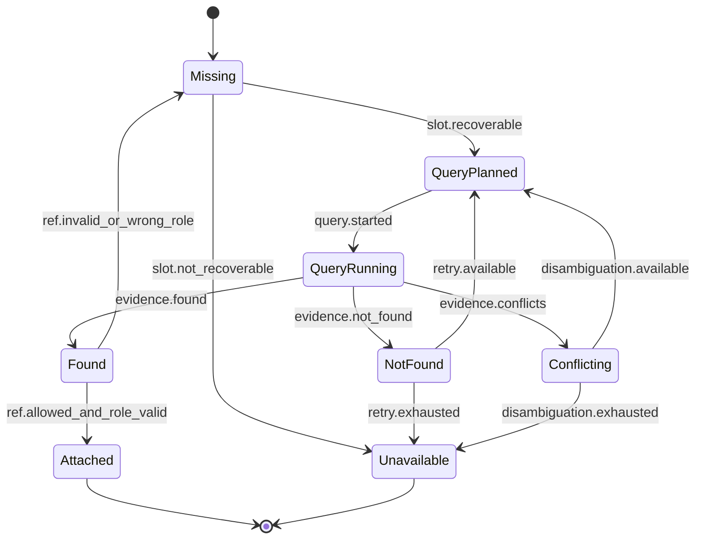

# S3 EvidenceRef and EvidenceSlot Contract

> Status: **draft**
> Scope: S3-internal evidence ledger, evidence-ref classification, and claim grounding slot policy
> Parent: [[wiki/canon/specs/s3-claim-evidence-state-machine/readme|S3 Claim-Evidence State Machine]]

This page defines how S3 should classify evidence refs and decide whether a vulnerability claim is locally grounded. It is intentionally generic: no rule here may depend on `certificate-maker` or only on `CWE-78`.

---

## 1. Terms

| Term | Meaning |
|---|---|
| Evidence record | Structured evidence object known to S3, produced by request input, S4, S5, code read, build metadata, or deterministic derivation. |
| EvidenceRef | Stable string identifier pointing to one evidence record in the S3 evidence ledger. |
| Evidence class | High-level role of an evidence record: `local`, `knowledge`, `derived`, or `operational`. |
| EvidenceSlot | A claim-level requirement that must be filled by evidence of an allowed class/role. |
| Local grounding | Evidence tied to the analyzed target code/build/artifact, not only a general weakness database. |
| Knowledge context | CWE/CVE/CAPEC/ATT&CK/threat knowledge used to explain or categorize a weakness. |
| Allowed ref set | EvidenceRefs that the final validator may accept because they exist in the S3 evidence ledger and are visible/authorized for final output. |

---

## 2. Source facts from existing contracts

S3 can form evidence from existing public contracts without changing S4/S5 APIs.

### S4 SAST Runner sources

From [[wiki/canon/api/sast-runner-api|SAST Runner API]]:

- `/v1/scan` returns `findings[]` with `toolId`, `ruleId`, `severity`, `message`, `location`, optional `dataFlow`, optional `origin`, and `metadata.cweId` / `metadata.cwe`.
- `/v1/functions` returns functions with `name`, `file`, `line`, and `calls[]`.
- `/v1/build` returns `buildEvidence` and `readiness` including `compileCommandsPath`, `userEntries`, `exitCode`, and readiness status.
- `/v1/build-and-analyze` may provide build + scan + `codeGraph` + libraries + metadata in one transitional response.

### S5 Knowledge Base sources

From [[wiki/canon/api/knowledge-base-api|Knowledge Base API]]:

- `/v1/search` and `/v1/search/batch` return threat knowledge hits such as CWE/CVE/CAPEC/ATT&CK nodes.
- `/v1/code-graph/{project_id}/ingest` turns S4 function/call data into a code GraphRAG surface with readiness fields.
- `/v1/code-graph/{project_id}/search`, `/callers/{function}`, `/callees/{function}`, and `/dangerous-callers` return target-code graph context.
- `/v1/cve/batch-lookup` returns library/CVE context and related CWE/ATT&CK enrichment.

S3's state machine should classify these outputs rather than relying on LLM-generated ref strings.

---

## 3. Evidence classes

### 3.1 Local evidence

Local evidence is tied to the analyzed target, target source, build artifact, or project-specific code graph.

Examples:

| Role | Typical source |
|---|---|
| `sast_finding` | S4 `findings[]` |
| `source_location` | S4 finding `location`, S4 function `file/line`, code.read_file slice |
| `source_slice` | bounded source lines around a location or symbol |
| `function_symbol` | S4 `/v1/functions`, S5 code graph hit |
| `sink_or_dangerous_api` | SAST finding, S5 dangerous callers/callees, source slice |
| `caller_chain` | S5 code graph callers/callees/search, S4 call graph |
| `input_or_dataflow_path` | S4 `dataFlow`, source slice, S5 code graph path, targeted code read |
| `build_context` | S4 `/v1/build` `buildEvidence`, compile DB, build readiness |
| `library_origin` | S4 `/v1/libraries`, local vendored path/origin/diff |

Local evidence can satisfy claim grounding slots.

### 3.2 Knowledge evidence

Knowledge evidence explains the weakness category, exploit pattern, impact, mitigation, or related public vulnerability.

Examples:

| Role | Typical source |
|---|---|
| `weakness_taxonomy` | S5 CWE hit |
| `attack_pattern` | S5 CAPEC / ATT&CK hit |
| `public_vulnerability` | S5 CVE lookup |
| `mitigation_context` | S5 threat/KB hit |
| `domain_relevance` | S5 automotive relevance / threat category |

Knowledge evidence cannot satisfy local grounding slots by itself.

### 3.3 Derived evidence

Derived evidence is produced by deterministic S3 processing from other records.

Examples:

- normalized SAST finding summary;
- computed caller-chain summary;
- evidence-slot diagnostic;
- quality-gate failure item;
- deterministic schema scaffold;
- explicit audited ref-repair result.

Derived evidence can support audit and repair, but it cannot replace the original local record unless it explicitly points back to the local refs it summarizes.

Mandatory derived-evidence metadata:

```json
{
  "class": "derived",
  "role": "caller_chain_summary",
  "sourceLocalRefs": ["eref-local-function:...", "eref-local-caller:..."]
}
```

If `sourceLocalRefs` is empty or absent, the derived record cannot support a claim.

### 3.4 Operational evidence

Operational evidence describes tool/service readiness, timeouts, partial results, or degraded status.

Examples:

- S4 `degraded=true` / `degradeReasons`;
- S5 `KB_NOT_READY` / `TIMEOUT`;
- S5 code graph `readiness.graphRag=false`;
- tool omission / tool unavailable status;
- retry budget exhaustion.

Operational evidence is never positive or negative vulnerability evidence by itself. It may only justify caveats, retries, result-level inconclusive outcomes, or task-level dependency diagnostics when no response can be assembled.

S4 `/v1/build` responses with `success=false` or `readiness.status` of `partial` / `not-ready` are operational evidence only. They do not fill `build_context`.

S5 `408 TIMEOUT`, `503 KB_NOT_READY`, and code-graph readiness false states are acquisition guard inputs. They may trigger retry, caveat, `analysisOutcome=inconclusive`, or task-level dependency failure only if no valid response can be assembled; they do not prove or disprove a vulnerability.

---

## 4. Mapping to current S3 EvidenceCatalog categories

The implementation should classify current categories into this ontology before enforcing final refs.

| Current category | Default class | Default role guidance |
|---|---|---|
| `sast` | `local` | `sast_finding`, with optional `source_location`, `sink_or_dangerous_api`, or `input_or_dataflow_path` when fields are present |
| `source` | `local` | `source_location`, `source_slice`, `function_symbol`, or `sink_or_dangerous_api` |
| `caller` | `local` | `caller_chain`, `function_symbol` |
| `callee` | `local` | `sink_or_dangerous_api`, `function_symbol` |
| `knowledge` | `knowledge` | `weakness_taxonomy`, `attack_pattern`, `public_vulnerability`, `mitigation_context` |
| `metadata` | depends on artifact type | build/target metadata may be `local.build_context`; model/tool/run metadata is `operational` |
| `request` | depends on artifact type | request-provided source/SAST/build refs may be `local`; request objective/constraints are operational/context, not claim support |
| `unknown` | none | cannot support a final claim until reclassified or rejected |

Classification must use ledger metadata first. Prefixes such as `eref-local-*` or `eref-knowledge-*` are human-readable hints, not the sole source of truth.

---

## 5. Claim ref policy

### 5.1 `claims[].supportingEvidenceRefs`

Conservative v1 rule:

> Claim-level `supportingEvidenceRefs` must contain local or derived-from-local evidence refs. Knowledge refs should not be used as claim-level support until S3 has role-aware claim refs.

This prevents a knowledge ref such as `eref-knowledge-CWE-78` from making a claim appear locally grounded.

Allowed in v1 claim refs:

- `local.sast_finding`
- `local.source_location`
- `local.source_slice`
- `local.function_symbol`
- `local.sink_or_dangerous_api`
- `local.caller_chain`
- `local.input_or_dataflow_path`
- `local.build_context`
- `local.library_origin`
- `derived.*` only if it includes explicit source local refs in its own record

Not allowed as sole claim support:

- `knowledge.*`
- `operational.*`
- LLM narrative without local refs

### 5.2 `usedEvidenceRefs`

Conservative v1 rule:

> `usedEvidenceRefs` should also be restricted to local or derived-from-local refs until the public API has a role-aware field for contextual/knowledge evidence.

This aligns the state-machine draft with the current S3 strict finalizer stance that `eref-knowledge-*` must not appear in `usedEvidenceRefs` or `claims[].supportingEvidenceRefs`.

Rule:

```text
claims[].supportingEvidenceRefs subset allowedLocalOrDerivedLocalRefs
usedEvidenceRefs subset allowedLocalOrDerivedLocalRefs
```

Future API option:

```json
{
  "usedEvidenceRefs": ["eref-local-sast:..."],
  "contextualEvidenceRefs": ["eref-knowledge-cwe:CWE-78"]
}
```

Until such a field is added to the Analysis Agent API and accepted by S2 consumers, knowledge refs must remain in caveats/detail prose or internal audit, not final evidence-ref lists.

### 5.3 Prompt-visible / ledger / validator alignment

There must be no third state where the prompt exposes a ref that final validation rejects without repair opportunity.

```text
promptVisibleRefs subset evidenceLedgerRefs
validatorAllowedRefs subset evidenceLedgerRefs
finalOutputRefs subset validatorAllowedRefs
```

If a prompt-visible ref is contextual-only, its role must be communicated to the LLM and it must be excluded from final ref fields unless a role-aware output field exists.

---

## 6. EvidenceRef namespace guidance

This page does not require S4/S5 to change their public IDs. S3 may assign internal refs while preserving provenance to original S4/S5 records.

Suggested internal namespace pattern:

```text
eref-local-sast:{toolId}:{stableFindingId}
eref-local-source:{file}:{lineStart}-{lineEnd}
eref-local-function:{file}:{line}:{functionName}
eref-local-sink:{file}:{line}:{calleeName}
eref-local-caller:{sinkName}:{callerName}:{depth}
eref-local-dataflow:{findingId}:{stepIndex}
eref-local-build:{buildSnapshotId}:{buildUnitId}
eref-local-library:{path}:{name}:{version}
eref-knowledge-cwe:{cweId}
eref-knowledge-cve:{cveId}
eref-knowledge-capec:{capecId}
eref-knowledge-attack:{techniqueId}
eref-derived:{kind}:{stableHash}
eref-operational:{kind}:{stableHash}
```

Compatibility note:

- Existing refs may be opaque or use older names such as `eref-sast-*`.
- The implementation should classify by ledger metadata first, not by string prefix alone.
- Prefixes are a human-readable convention, not the only source of truth.

---

## 7. EvidenceSlot catalog

Slots are claim requirements. A slot has an allowed evidence class/role and a recovery strategy.

| Slot | Meaning | Allowed evidence roles | Typical recovery |
|---|---|---|---|
| `sast_finding` | A deterministic tool flagged a relevant issue | `local.sast_finding` | S4 `/v1/scan`; precomputed `sastFindings` |
| `source_location` | File/line/symbol where the issue occurs | `local.source_location`, `local.function_symbol` | S4 finding/function data; code read |
| `source_slice` | Bounded code excerpt around the issue | `local.source_slice` | `code.read_file`; source files in request |
| `sink_or_dangerous_api` | Vulnerable operation or sink | `local.sink_or_dangerous_api`, `local.source_slice` | SAST finding; S5 dangerous-callers/callees; code read |
| `caller_chain` | How the vulnerable function is reached locally | `local.caller_chain`, `local.function_symbol` | S5 code graph callers/callees/search; S4 call graph |
| `input_or_dataflow_path` | User/config/network/file input path to sink | `local.input_or_dataflow_path`, `local.source_slice`, SAST `dataFlow` | SAST `dataFlow`; S5 code graph search; code read |
| `build_context` | Build/compile artifact that makes the target analyzable/reproducible | `local.build_context` | S4 `/v1/build`, Build Agent output |
| `target_metadata` | Target architecture/compiler/macros that affect analysis interpretation | `local.build_context` or `local.target_metadata` | S4 `/v1/metadata`, build metadata |
| `library_origin` | Project-local vendored dependency provenance | `local.library_origin` | S4 `/v1/libraries` |
| `knowledge_context` | CWE/CVE/CAPEC/ATT&CK explanation | `knowledge.*` | S5 `/v1/search`, `/v1/search/batch`, `/v1/cve/batch-lookup` |
| `operational_context` | Tool readiness/timeout/partial caveat | `operational.*` | S4/S5 health/error/readiness outputs |

---

## 8. EvidenceSlot lifecycle



---

## 9. Draft required-slot policy by vulnerability family

This table is intentionally a starting point. It should be refined as more CWE families are tested.

| Family | Required local slots | Strongly recommended slots | Knowledge slots |
|---|---|---|---|
| Command injection | `source_location`, `sink_or_dangerous_api`, `caller_chain` or `source_slice`; `sast_finding` if S4 reported one | `input_or_dataflow_path`, `build_context` | CWE/CAPEC/ATT&CK explanation |
| Memory bounds / buffer overflow | `source_location`, `source_slice`, sink/API or write expression; `sast_finding` if available | size/bounds reasoning, caller context, build context | CWE/CVE/CAPEC context |
| Null dereference | `source_location`, dereference expression/source slice; `sast_finding` if available | null-origin/control-path evidence, caller context | CWE context |
| Integer overflow / truncation | arithmetic expression/source slice, impacted value/use site; `sast_finding` if available | range/input evidence, sink/use after overflow | CWE context |
| Path traversal / file access | file operation sink, path construction source slice, source location | input path and sanitization evidence | CWE/CAPEC context |
| Use-after-free / lifetime | allocation/free/use source slices or SAST path | caller/control path, ownership/lifetime summary | CWE context |
| Third-party vulnerable dependency | `library_origin`, local dependency path/version | build context, CVE version-match evidence | CVE/CWE/KEV/EPSS context |

Important nuance:

- `sast_finding` is required when the system is making a SAST-backed claim.
- If SAST does not report a finding but S3 proposes a claim from code graph/source reasoning, the claim must still satisfy local source/sink/caller/input slots and must be marked as not SAST-backed.
- A claim should not be accepted if it has only `knowledge_context` and no local slot.

---

## 10. Validation algorithm sketch

For each draft response:

1. Build the evidence ledger from request refs, S4 outputs, S5 outputs, code reads, build artifacts, and deterministic derivations.
2. Classify each evidence record into `local`, `knowledge`, `derived`, or `operational` plus one or more roles.
3. Compute `allowedFinalRefs` from local refs plus derived refs that summarize local refs.
4. Compute `allowedClaimRefs` from the same local/derived-local set.
5. Validate `usedEvidenceRefs subset allowedFinalRefs`.
6. Validate each `claims[].supportingEvidenceRefs subset allowedClaimRefs`.
7. For each claim, classify vulnerability family and compute required evidence slots.
8. Fill slots from claim refs and ledger records.
9. If slots are missing and recoverable, transition to `EvidenceAcquisitionPlanned`.
10. If slots are missing after recovery, classify the claim/result as `no_accepted_claims` or `inconclusive` with diagnostics unless a task-level dependency/runtime failure prevents any valid response.

---

## 11. Diagnostics required before no-accepted/inconclusive grounding outcome

A no-accepted-claim or inconclusive grounding outcome must include enough data for hotN failure grouping and repair planning.

Required diagnostic fields conceptually:

```json
{
  "invalidRefs": ["eref-knowledge-CWE-78"],
  "invalidRefRoles": [
    {
      "refId": "eref-knowledge-CWE-78",
      "actualClass": "knowledge",
      "requiredClass": "local",
      "path": "claims[0].supportingEvidenceRefs"
    }
  ],
  "missingSlots": ["caller_chain", "input_or_dataflow_path"],
  "availableLocalRefs": ["..."],
  "availableKnowledgeRefs": ["..."],
  "attemptedAcquisitions": [
    {"slot": "caller_chain", "tool": "s5.code_graph.callers", "status": "not_found"}
  ],
  "retryBudget": {"level1": 0, "level3": 0}
}
```

The exact response-body schema can be refined later, but the information must be present in audit or result diagnostics.

---

## 12. Grounding deficiency is not task failure

Missing or invalid evidence refs/slots should not directly become task-level failure when S3 can still assemble a valid honest response. After explicit audited repair, targeted acquisition, and clean retry are exhausted, S3 should classify the result as `no_accepted_claims` or `inconclusive` rather than fabricate evidence or fail the task.

---

## 13. Ref repair rules

When refs are invalid:

1. Enter an explicit ref repair state; do not silently normalize final output.
2. Emit an audit event containing invalid refs, invalid paths, actual class, required class, and attempted repair level.
3. Remove refs not present in the evidence ledger.
4. Remove knowledge refs from `claims[].supportingEvidenceRefs` and `usedEvidenceRefs` in v1 unless and until the API gains role-aware contextual evidence fields.
5. Recompute claim refs only from ledger-backed local refs correlated by claim family, source location, sink, caller/source linkage, SAST finding, or dependency tuple.
6. Recomputed refs must not be added solely because they are available globally in the request.
7. If no correlated local refs remain, do not fabricate refs; transition to `GroundingDeficient` and attempt evidence acquisition.
8. Revalidate before final response.

This is the generic replacement for benchmark-specific final-output cleanup patches.

---

## 14. Open decisions

1. Should S3 add role-aware evidence objects to the public response in a future API version, or keep list-of-ref strings and enforce the conservative claim-ref rule?
2. Should knowledge refs move to a future field such as `contextualEvidenceRefs`?
3. What is the minimum slot policy for non-SAST-backed claims?
4. Should `sast_finding` be mandatory for paper/evaluation mode even when code graph/source reasoning finds a plausible claim?
5. How should conflicting evidence be represented: caveat, rejected claim, or lower confidence?

---

## 15. Required fixture tests

The implementation should include fixture tests where the LLM emits:

- `usedEvidenceRefs: ["eref-knowledge-CWE-78"]` and no local refs;
- `claims[0].supportingEvidenceRefs: ["eref-knowledge-CWE-78"]`;
- a hallucinated ref not present in the ledger;
- only SAST ref but no source/sink/caller slot;
- only source/sink refs but no SAST ref in SAST-backed mode;
- knowledge refs plus valid local refs;
- derived summary refs whose source local refs are absent;
- operational refs used as vulnerability support.

Expected behavior:

- invalid refs are repaired or rejected through an explicit audited state before final validation;
- knowledge-only support cannot produce an accepted claim;
- local slots are either filled, acquired, or diagnosed as missing;
- no task-level failure is returned for grounding deficiency when S3 can assemble a completed no-accepted/inconclusive response after repair/acquisition budgets are exhausted.
