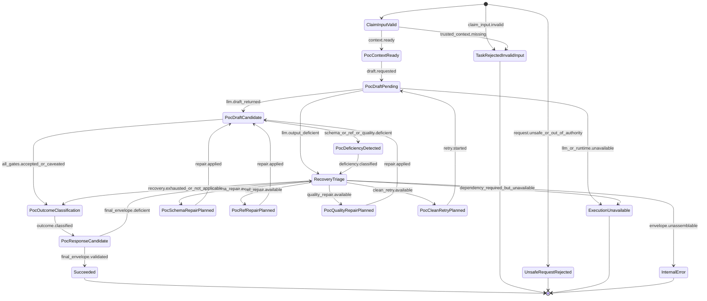

# S3 Generate-PoC Lifecycle Statechart

> Status: **draft**
> Scope: `generate-poc` task state machine after `deep-analyze` accepted claim(s)
> Parent: [[wiki/canon/specs/s3-claim-evidence-state-machine/readme|S3 Claim-Evidence State Machine]]

`generate-poc` is claim-bound. If the claim input is valid and runtime is alive, S3 should return `completed` with `pocOutcome=poc_accepted` or `poc_rejected`, not task-level quality failure.

---

## 1. Preconditions

`generate-poc` may start only when the input claim satisfies the accepted-claim contract:

- claim statement/detail;
- source location where required;
- local or derived-local supporting refs;
- evidence ledger or trusted refs sufficient to bind the claim;
- safety constraints.

A missing/invalid claim is caller input failure. A valid claim that cannot yield an acceptable PoC is result-level `poc_rejected`.

---

## 2. PoC lifecycle statechart

---

## 3. PoC outcomes

| Outcome | Meaning | Task status |
|---|---|---|
| `poc_accepted` | PoC is claim-bound, non-destructive, quality-valid | `completed` |
| `poc_accepted` | PoC is acceptable but assumptions/limits are visible | `completed` |
| `poc_rejected` | PoC cannot satisfy quality/safety after repair | `completed` |
| `poc_inconclusive` | PoC cannot be produced honestly with available context | `completed` |

---

## 4. Task-level failures

Task-level failure is limited to:

- invalid/missing claim input;
- claim input that does not satisfy accepted-claim contract;
- unsafe/out-of-authority request;
- LLM/runtime dependency unavailable;
- hard timeout/cancellation;
- internal exception preventing any valid response.

---

## 5. PoC invariants

1. PoC cannot change accepted claim identity.
2. PoC cannot invent source locations or supporting refs.
3. PoC must preserve or correctly subset claim local refs.
4. PoC must be non-destructive by default.
5. PoC quality rejection is represented by `pocOutcome=poc_rejected`, not task failure, when the input/runtime are valid.
6. Hot gates must inspect `pocOutcome`, not only task status.

---

## 6. PoC repair examples

| Failed item | Repair action |
|---|---|
| missing `binary_path_real` | derive binary path from build context, or add explicit caveat |
| missing `side_effect_detection` | add canary/observable marker check |
| missing `randomized_canary` | generate per-run token |
| missing `quote_awareness` | add quoting/escaping caveat and avoid unsafe composition |
| missing `non_destructive` | add dry-run/sandbox/non-mutating guard |
| unsupported refs | explicit audited ref repair; never invent refs |

---

## 7. Acceptance criteria for implementation

1. Valid claim input + live runtime yields `completed` with `pocOutcome`.
2. PoC quality rejection does not become task-level failure.
3. Invalid claim input still fails as caller contract error.
4. Repair cannot change accepted claim identity.
5. HotN reports separate generate-poc task completion from PoC clean pass.
