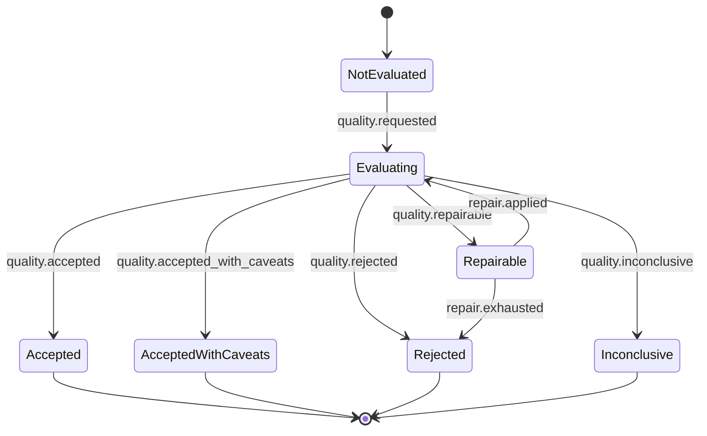

# S3 Quality Gates as Outcome Classifiers

> Status: **draft**
> Scope: deep-analysis and PoC quality gates for S3 outputs
> Parent: [[wiki/canon/specs/s3-claim-evidence-state-machine/readme|S3 Claim-Evidence State Machine]]

Quality Gate is now the central classifier that separates normal task completion from result quality. It is not a terminal task-failure generator.

---

## 1. Core rule

```text
quality gate = outcome classifier + repair planner
```

A gate result must say whether the artifact is accepted, accepted with caveats, repairable, rejected, or inconclusive.

---

## 2. QualityGate statechart



---

## 3. Gate output shape

Conceptual internal shape:

```json
{
  "gate": "deep_claim_quality",
  "outcome": "rejected",
  "resultOutcome": "no_accepted_claims",
  "failedItems": [
    {
      "id": "missing_input_path",
      "repairable": false,
      "requiredEvidenceSlots": ["input_or_dataflow_path"],
      "repairAttempts": ["s5.code_graph.callers", "source_slice_read", "clean_deep_retry"]
    }
  ],
  "caveats": ["No claim satisfied local grounding after recovery."],
  "needsHumanReview": true
}
```

---

## 4. Deep-analysis quality outcomes

| Gate outcome | Result-level mapping | Meaning |
|---|---|---|
| `accepted` | `analysisOutcome=accepted_claims` | Claim(s) are locally grounded and quality-valid. |
| `accepted_with_caveats` | `analysisOutcome=accepted_claims`, `qualityOutcome=accepted_with_caveats` | Claim(s) are acceptable but uncertainty/partiality must be visible; this is completed but not strict clean pass. |
| `repairable` | return to RecoveryTriage | Failed items can be repaired/acquired. |
| `rejected` | `analysisOutcome=no_accepted_claims` or claim excluded | Claim cannot be accepted honestly after recovery. |
| `inconclusive` | `analysisOutcome=inconclusive` | Evidence/tool partiality prevents honest acceptance or rejection. |

---

## 5. PoC quality outcomes

| Gate outcome | Result-level mapping | Meaning |
|---|---|---|
| `accepted` | `pocOutcome=poc_accepted` | PoC is claim-bound, non-destructive, and quality-valid. |
| `accepted_with_caveats` | `pocOutcome=poc_accepted`, `qualityOutcome=accepted_with_caveats` | PoC is acceptable but assumptions must be visible; this is completed but not strict clean pass. |
| `repairable` | return to PoC repair | Failed items can be repaired. |
| `rejected` | `pocOutcome=poc_rejected` | PoC is immediately unsafe, hallucinated-ref, or grounding-deficient. |
| `inconclusive` | `pocOutcome=poc_inconclusive`, optionally `qualityOutcome=repair_exhausted` | PoC cannot be produced honestly with available context, including bounded quality-repair exhaustion. |

---

## 6. Deep-analysis quality dimensions

| Item | Meaning | Typical repair action |
|---|---|---|
| `claim_specificity` | concrete issue, not generic CWE restatement | repair statement/detail using source/sink refs |
| `location_present` | source file/line/symbol | acquire source/function/location slot |
| `local_evidence_present` | local refs exist | ref repair or evidence acquisition |
| `sink_identified` | dangerous operation/write/deref/file op explicit | source slice / SAST / code graph query |
| `caller_or_reachability_present` | local reachability enough for family | code graph callers/callees/search |
| `input_or_dataflow_present` | input path/dataflow identified where required | SAST dataFlow/code graph/source query |
| `knowledge_context_bounded` | knowledge is context, not proof | move to caveat/context; remove from final refs |
| `caveats_honest` | partial evidence/tool limits visible | add caveats, needsHumanReview |

---

## 7. PoC quality dimensions

| Item | Meaning | Typical repair action |
|---|---|---|
| `claim_bound` | targets accepted claim | bind to claim fields/refs |
| `binary_path_real` | uses real build path or caveat | derive from build context or caveat |
| `non_destructive` | avoids destructive effects | add safe markers/guards |
| `side_effect_detection` | observable detection path | add canary/marker check |
| `randomized_canary` | avoids trivial marker | generate per-run token |
| `quote_awareness` | handles shell/path quoting | add quoting/escaping caveat |
| `repro_steps` | bounded setup/run/observe | repair from build/source context |
| `limitations_caveated` | assumptions visible | add limitations |

---

## 8. Hot-gate implication

`completed` is necessary but not sufficient for clean pass.

```text
clean deep pass = completed + analysisOutcome=accepted_claims + qualityOutcome=accepted
clean PoC pass = completed + pocOutcome=poc_accepted + qualityOutcome=accepted
```

A completed `no_accepted_claims`, `inconclusive`, `accepted_with_caveats`, `poc_rejected`, or `poc_inconclusive` response is task success but not strict clean pass unless a named non-strict policy explicitly counts it.

---

## 9. Acceptance criteria for implementation

1. Quality gates return structured outcomes, not booleans only.
2. Repairable outcomes include repair actions.
3. Rejected/inconclusive outcomes can still become schema-valid completed responses.
4. Failed quality does not become task-level failure unless no valid response envelope can be assembled.
5. HotN reports distinguish task completion rate from clean quality pass rate.

---

## 10. 2026-05-09 strict PoC oracle / anomaly golden set

S3 now treats Generate-PoC as part of the strict quality gate, not an optional
operational side channel. HotN/hot11 gates must reject "completed but internally
weird" PoC envelopes unless the PoC is a clean accepted result.

Strict clean PoC means all of the following are true:

```text
task status = completed
result.pocOutcome = poc_accepted
result.qualityOutcome = accepted
result.cleanPass = true
```

The hot11 oracle therefore uses `passRequiresCleanPocForMatchedFindings=true`.
Legacy reports where analysis findings matched but Generate-PoC returned
`poc_inconclusive`, `qualityOutcome=rejected`, or `cleanPass=false` must be
classified as oracle failures/anomalies, not paper-quality passes.

Additional current implementation rules:
- every PoC claim must carry both `supportingEvidenceRefs` and `location`;
- every PoC detail must include bounded repro structure, expected observation,
  and a non-destructive safety boundary;
- command-injection PoCs require a randomized non-destructive canary;
- deterministic source-grounded PoC fallback may be used when the LLM output
  path is deficient but accepted input-claim refs and local source context are
  sufficient;
- deterministic fallback must not embed raw source text in a way that trips
  shell/code-fence/base64 safety detectors; source notes are rendered as inert
  prose;
- CWE-798/259/321/532 and hardcoded/default credential findings are classified
  as source-backed `credential_exposure`, not dependency advisories requiring
  `library_origin`.

Golden coverage:
- `services/analysis-agent/eval/golden/qg_anomaly_oracle.json` records the
  anomaly buckets for non-clean completed envelopes, dependency/task failures,
  and strict-clean accepted PoCs.
- `services/analysis-agent/eval/quality_gate_oracle.py` evaluates the anomaly
  oracle.
- `services/analysis-agent/eval/golden/hot11_full_pipeline_oracle.json` is the
  strict hot11 full-pipeline oracle and requires clean PoC for matched findings.

Fresh verification:
- full Analysis Agent unit suite: `615 passed in 6.71s`;
- anomaly oracle self-check: `passed=True`, `caseCount=5`;
- old 2026-05-08 hot11 report strict re-evaluation: 11/11 cases fail because
  PoCs were completed-but-non-clean;
- fresh strict live hot11 full pipeline:
  `reports/hot11-qg-live-all-20260508T183529Z` → 11/11 cases passed, 11/11
  clean PoCs.
