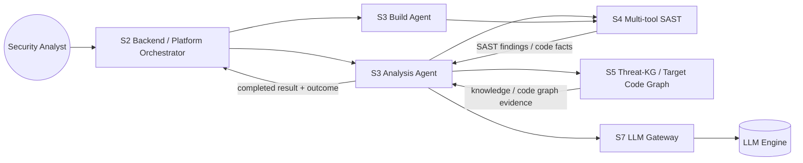

# S3 Claim-Evidence State Machine

> Status: **draft canonical design surface**
> Owner: **S3**
> Current decision: **task completion and result quality/outcome are separate**

This page family defines the durable architecture contract for S3's claim/evidence/retry/quality controller. It is not a one-off fix plan for `certificate-maker` or `CWE-78`; it is the generic state-machine design that should govern `deep-analyze`, `generate-poc`, and future S3 agent hardening work.

---

## 1. Final agreement

The controller contract is now:

> If caller input is valid and S3's LLM/runtime dependencies are alive, S3 should not return task-level failure for its own schema/ref/grounding/quality/PoC deficiencies. It must drive those deficiencies through RecoveryTriage and return a schema-valid `completed` response with an honest result-level outcome.

`completed` therefore means:

```text
S3 processed the request and returned a validated, honest result envelope.
```

It does **not** automatically mean:

```text
A vulnerability claim was accepted.
A PoC was accepted.
The hot/evaluation quality gate is clean-pass.
```

---

## 2. Two-layer outcome model

### Task status

Task status answers whether S3 could execute the request and return a valid result envelope.

Examples:

```text
completed
validation_failed
model_error
timeout
internal_error
```

Task-level failure is reserved for cases where S3 cannot responsibly produce a schema-valid completed response.

### Result outcome

Result outcome answers what the analysis/PoC quality gate decided.

Examples:

```text
analysisOutcome:
  accepted_claims
  no_accepted_claims
  inconclusive

pocOutcome:
  poc_accepted
  poc_rejected
  poc_inconclusive
  poc_not_requested

qualityOutcome:
  accepted
  accepted_with_caveats
  rejected
  inconclusive
  repair_exhausted
```

---

## 3. Task-level failure boundary

Immediate or terminal task failure is appropriate for:

1. invalid caller contract / malformed task envelope;
2. missing trusted input that S3 has no authority to create;
3. unsupported task type;
4. `generate-poc` with no claim input or a claim that does not satisfy the accepted-claim contract;
5. clearly unsafe or out-of-authority request;
6. LLM/S7/runtime dependency unavailable;
7. hard timeout, cancellation, or resource exhaustion preventing a response;
8. internal exception that prevents schema-valid envelope assembly.

Task-level failure is **not** appropriate for ordinary S3-owned deficiencies:

- invalid LLM schema output;
- unsupported/wrong-role evidence refs;
- missing grounding slots;
- no accepted claims after repair;
- claim quality rejection;
- PoC quality rejection;
- final response draft deficiency that can be repaired.

Those must enter [[wiki/canon/specs/s3-claim-evidence-state-machine/taskrun-statechart|RecoveryTriage]].

---

## 4. Design principles

1. **Completed is not clean pass** — E2E quality gates must inspect result-level outcomes.
2. **Failure signals are not terminal** — schema/ref/grounding/quality signals enter RecoveryTriage.
3. **Quality Gate is the classifier** — quality does not merely pass/fail; it classifies accepted, caveated, rejected, inconclusive, or repair-exhausted outcomes.
4. **Evidence-first** — accepted claims require local or derived-from-local evidence.
5. **Knowledge is contextual** — CWE/CVE/CAPEC/threat refs cannot ground claims in v1.
6. **No fabrication** — S3 may reject/inconclude claims but must not invent evidence to make them pass.
7. **No target-specific patches** — vulnerability-family behavior enters only through generic evidence-slot policy.
8. **Public API deltas are gated** — result-level outcome fields require API/S2 alignment before implementation.

---

## 5. Page map

1. [[wiki/canon/specs/s3-claim-evidence-state-machine/taskrun-statechart|TaskRun Statechart]] — task-level execution, RecoveryTriage, completed/outcome separation.
2. [[wiki/canon/specs/s3-claim-evidence-state-machine/evidence-ref-and-slots|EvidenceRef and EvidenceSlot Contract]] — local/knowledge/derived/operational evidence and grounding slots.
3. [[wiki/canon/specs/s3-claim-evidence-state-machine/retry-repair-policy|Retry and Repair Policy]] — deficiency taxonomy, recovery levels, and result-outcome fallback.
4. [[wiki/canon/specs/s3-claim-evidence-state-machine/claim-lifecycle|Claim Lifecycle Statechart]] — candidate, accepted, rejected, and audit lifecycle of claims.
5. [[wiki/canon/specs/s3-claim-evidence-state-machine/quality-gates|Quality Gates as Outcome Classifiers]] — quality gate as result outcome classifier and repair planner.
6. [[wiki/canon/specs/s3-claim-evidence-state-machine/poc-lifecycle|Generate-PoC Lifecycle]] — claim-bound PoC generation and `pocOutcome` classification.
7. [[wiki/canon/specs/s3-claim-evidence-state-machine/invariants|Invariants]] — non-negotiable state-machine rules.
8. [[wiki/canon/specs/s3-claim-evidence-state-machine/transition-table|Transition Table]] — implementation-facing transition rows.
9. [[wiki/canon/specs/s3-claim-evidence-state-machine/implementation-work-packages|Implementation Work Packages]] — concrete code/test slices.
10. [[wiki/canon/specs/s3-claim-evidence-state-machine/api-contract-decisions|API Contract Decisions]] — WP0 public schema/outcome-field gate.

---

## 6. Actor / component map



---

## 7. Initial invariants

1. `completed` means final envelope schema is valid and honest.
2. `completed` does not imply accepted claims, accepted PoC, or clean hot-gate pass.
3. `accepted_claims` implies each accepted claim has local or derived-from-local refs.
4. `no_accepted_claims` and `inconclusive` are valid result-level outcomes, not task failures, when the task input/runtime are valid.
5. `poc_rejected` and `poc_inconclusive` are valid result-level outcomes, not task failures, when claim input/runtime are valid but PoC quality/safety cannot produce a clean accepted PoC. Repair exhaustion maps to `poc_inconclusive`; immediate unsafe/ref/grounding failure maps to `poc_rejected`.
6. Knowledge refs cannot satisfy local grounding slots.
7. Internal deficiencies must pass through RecoveryTriage before outcome classification.
8. Task-level failure is reserved for invalid input, out-of-authority/unsafe request, unavailable runtime/dependency, hard timeout/cancellation, or internal exception preventing any valid response.
9. Hot/evaluation clean pass must evaluate result-level outcome and quality, not just task `completed`.

---

## 8. Immediate next work

The next implementation-facing task is WP0: update/align the public Analysis Agent API and S2 consumer contract for result-level outcome fields before controller code is changed.
