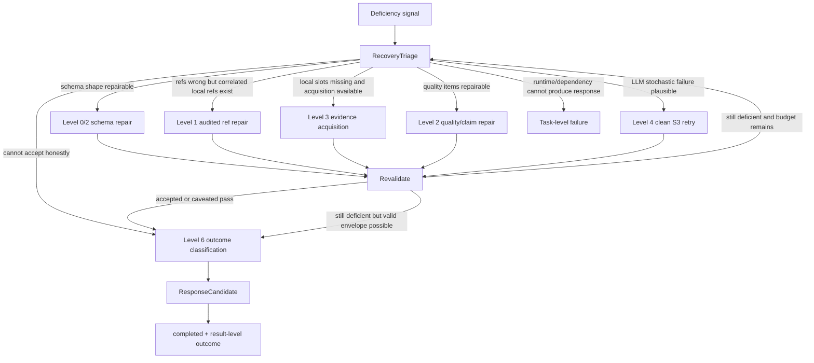

# S3 Retry and Repair Policy

> Status: **draft**
> Scope: RecoveryTriage policy for S3-owned deficiencies
> Parent: [[wiki/canon/specs/s3-claim-evidence-state-machine/readme|S3 Claim-Evidence State Machine]]

This page no longer treats schema/ref/grounding/quality deficiencies as task-level failures. They are deficiency signals that should flow through RecoveryTriage and eventually produce either an accepted result or an honest completed result-level outcome.

---

## 1. Core rule

```text
failure signal -> RecoveryTriage -> repair/retry/acquire -> revalidate -> outcome classification -> completed
```

Task-level failure is reserved for invalid input, unsafe/out-of-authority request, dependency/runtime unavailability, hard timeout/cancellation, or internal exception preventing any schema-valid response.

---

## 2. Deficiency taxonomy

| Deficiency | Typical signal | Recovery first | If not accepted after recovery |
|---|---|---|---|
| `SCHEMA_DEFICIENT` | missing fields, wrong types, malformed LLM object | deterministic scaffold; bounded schema repair; clean retry | completed with `analysisOutcome=inconclusive` or `qualityOutcome=repair_exhausted` if envelope can be valid |
| `REFS_DEFICIENT` | hallucinated refs, wrong-role refs, knowledge refs in final refs | explicit audited ref repair; correlated local ref recomputation; evidence acquisition | completed with no accepted claim / inconclusive |
| `GROUNDING_DEFICIENT` | missing local slots | targeted S4/S5/code/source/build acquisition; clean retry | completed with `analysisOutcome=no_accepted_claims` or `inconclusive` |
| `QUALITY_DEFICIENT` | failed quality rubric | failed-item repair actions; bounded LLM repair; evidence acquisition if needed | completed with rejected/inconclusive quality outcome |
| `POC_DEFICIENT` | PoC schema/ref/quality/safety issue | PoC schema repair; PoC quality repair; claim rebinding | completed with `pocOutcome=poc_rejected` |
| `LLM_OUTPUT_DEFICIENT` | non-JSON, malformed finalizer output, instruction drift | structured retry; strict finalizer; clean S3 retry | completed with inconclusive outcome if valid envelope can be assembled |
| `ALL_CANDIDATE_CLAIMS_REJECTED` | canonicalization rejects all claims | clean retry; optional evidence acquisition; outcome classification | completed with `analysisOutcome=no_accepted_claims` |
| `PARTIAL_EVIDENCE` | S4/S5 partial/timeout/readiness caveat but runtime can continue | alternative acquisition; caveat; quality classification | completed with `analysisOutcome=inconclusive` if no claim can be accepted |

---

## 3. Task-level failure taxonomy

| Failure | Use when | Typical API mapping |
|---|---|---|
| `CALLER_CONTRACT_INVALID` | caller input is malformed, unsupported, or missing required trusted input | 400/422 |
| `UNSAFE_OR_OUT_OF_AUTHORITY` | request cannot be handled safely or within S3 authority | 422 / policy failure |
| `DEPENDENCY_UNAVAILABLE` | LLM/S7/S4/S5 required for any response is unavailable and no response can be assembled | 503 |
| `HARD_TIMEOUT_OR_CANCELLED` | task cannot continue or return envelope within hard runtime constraints | 504/cancelled |
| `INTERNAL_ERROR` | S3 bug prevents valid response assembly | 500 |

Everything else should aim for `completed` plus result-level outcome.

---

## 4. Recovery levels

| Level | Name | Purpose | Terminal? |
|---:|---|---|---|
| 0 | Deterministic scaffold | Make a valid envelope/object shape without inventing evidence | no |
| 1 | Explicit audited ref repair | Remove/rebind refs only through ledger-backed correlated local refs | no |
| 2 | Bounded LLM repair | Repair claim/PoC details from failed items without changing identity or inventing refs | no |
| 3 | Targeted evidence acquisition | Query S4/S5/code/build for missing local slots | no |
| 4 | Clean S3 retry | Restart S3 draft/finalizer from same upstream artifacts | no |
| 5 | Full pipeline retry request | Ask runner/caller to rerun upstream when it owns full E2E | normally outside S3 task |
| 6 | Outcome classification | Produce honest result-level outcome when acceptance is not possible | leads to `completed` |

---

## 5. Recovery decision flow



---

## 6. Outcome classification after exhausted recovery

Recovery exhaustion is not automatically task failure. It should be classified like this:

| Exhausted condition | Result-level outcome |
|---|---|
| no claim can be locally grounded | `analysisOutcome=no_accepted_claims` |
| evidence/tool partiality prevents a confident claim | `analysisOutcome=inconclusive` |
| quality repair exhausted for claims | `qualityOutcome=rejected` or `qualityOutcome=repair_exhausted` |
| PoC cannot satisfy safety/quality | `pocOutcome=poc_rejected` |
| final envelope cannot be assembled at all | task-level `INTERNAL_ERROR` |
| runtime/dependency unavailable before any result can be built | task-level unavailable/timeout failure |

---

## 7. Audit requirements

Every recovery attempt should record:

- deficiency class;
- selected recovery level;
- attempt number and remaining budget;
- evidence slots or rubric items involved;
- repair/acquisition action;
- result of the action;
- final result-level outcome if recovery does not produce acceptance.

---

## 8. Acceptance criteria for implementation

1. Deficiency signals do not directly produce task-level failure.
2. RecoveryTriage is the only path from S3-owned deficiency to repair/retry/outcome classification.
3. Recovery exhaustion produces completed honest outcomes when a valid envelope can be assembled.
4. Task-level failure is limited to invalid input, unsafe/out-of-authority request, unavailable runtime/dependency, hard timeout/cancellation, or internal exception.
5. Hot gates distinguish `completed` from clean quality pass.
