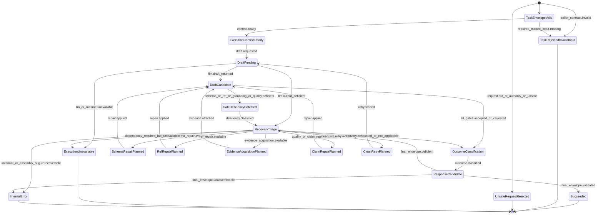

# S3 Claim-Evidence TaskRun Statechart

> Status: **draft**
> Scope: one `deep-analyze` task run inside S3 Analysis Agent
> Parent: [[wiki/canon/specs/s3-claim-evidence-state-machine/readme|S3 Claim-Evidence State Machine]]

This statechart uses the current agreement: S3-owned deficiencies should not jump directly to task-level failure. They flow through `RecoveryTriage` and, if no accepted claim can be produced honestly, become result-level outcomes in a schema-valid `completed` response.

---

## 1. TaskRun v2 statechart



---

## 2. State definitions

| State | Meaning |
|---|---|
| `TaskEnvelopeValid` | Caller task envelope is syntactically valid and supported. |
| `TaskRejectedInvalidInput` | Caller contract is invalid or required trusted input is absent. This is task-level failure. |
| `UnsafeRequestRejected` | Request is outside S3 authority or violates safety policy. This is task-level failure. |
| `ExecutionContextReady` | Evidence ledger, prompt-visible context, and validator policy can be computed. |
| `DraftPending` | S3 is waiting for LLM/finalizer output. |
| `DraftCandidate` | A draft exists and can be validated/classified. |
| `GateDeficiencyDetected` | Schema/ref/grounding/quality deficiency has been detected. This is not terminal. |
| `RecoveryTriage` | Central decision state for repair, evidence acquisition, bounded LLM repair, clean retry, or outcome classification. |
| `SchemaRepairPlanned` | Deterministic or bounded schema repair is selected. |
| `RefRepairPlanned` | Explicit audited ref repair is selected. |
| `EvidenceAcquisitionPlanned` | Targeted S4/S5/code/build evidence acquisition is selected. |
| `ClaimRepairPlanned` | Bounded claim/quality repair is selected. |
| `CleanRetryPlanned` | Clean S3 retry over the same upstream artifacts is selected. |
| `OutcomeClassification` | S3 classifies the honest result outcome: accepted, no accepted claims, inconclusive, repair exhausted, etc. |
| `ResponseCandidate` | A final response envelope exists and must be schema-valid. |
| `Succeeded` | S3 returns HTTP 200 / `status=completed` with result-level outcome. |
| `ExecutionUnavailable` | LLM/S7/tool/runtime dependency or hard timeout prevents a response. This is task-level failure. |
| `InternalError` | S3 cannot assemble any valid response due to internal exception/invariant bug. |

---

## 3. Result-level outcomes produced by `OutcomeClassification`

Examples:

| Outcome | Meaning | Task status |
|---|---|---|
| `accepted_claims` | one or more claims accepted by evidence and quality gates | `completed` |
| `accepted_claims` + `qualityOutcome=accepted_with_caveats` | one or more claims accepted but caveats/human review are required; completed but not strict clean pass | `completed` |
| `no_accepted_claims` | candidates were rejected or no claim satisfied local grounding/quality | `completed` |
| `inconclusive` | S3 cannot honestly accept a claim due to partial evidence/tool limits, but can report that fact | `completed` |
| `qualityOutcome=repair_exhausted` | quality repair attempts exhausted; output is honest but not clean pass | `completed` |

---

## 4. Task-level failure semantics

Task-level failure states are now narrow:

| State | Typical HTTP/status | Reason |
|---|---|---|
| `TaskRejectedInvalidInput` | 400/422 | caller contract invalid, missing required trusted input, unsupported task type |
| `UnsafeRequestRejected` | 422/403-like policy code if introduced | request outside S3 authority or unsafe |
| `ExecutionUnavailable` | 503/504 | LLM/S7/tool/runtime unavailable or hard timeout/cancellation |
| `InternalError` | 500 | S3 bug prevents schema-valid envelope assembly |

Schema/ref/grounding/quality deficiencies are not task-level failure if S3 can still return an honest completed result.

---

## 5. Hot-gate implication

Hot/evaluation gates must not use `status=completed` alone.

```text
completed + analysisOutcome=accepted_claims + qualityOutcome=accepted + pocOutcome=poc_accepted
= strict clean pass

completed + analysisOutcome=no_accepted_claims
= task completed, analysis quality/evaluation not clean pass

completed + pocOutcome=poc_rejected
= task completed, PoC output rejected for immediate unsafe/ref/grounding reasons, not clean pass

completed + pocOutcome=poc_inconclusive
= task completed, PoC quality repair exhausted or context cannot support a safe conclusion, not clean pass
```

---

## 6. Guard-definition cross-references

- [[wiki/canon/specs/s3-claim-evidence-state-machine/evidence-ref-and-slots|EvidenceRef and EvidenceSlot Contract]] defines local vs knowledge refs and missing-slot recovery.
- [[wiki/canon/specs/s3-claim-evidence-state-machine/retry-repair-policy|Retry and Repair Policy]] defines RecoveryTriage choices.
- [[wiki/canon/specs/s3-claim-evidence-state-machine/quality-gates|Quality Gates]] defines outcome classification.
- [[wiki/canon/specs/s3-claim-evidence-state-machine/transition-table|Transition Table]] consolidates implementation-facing rows.
