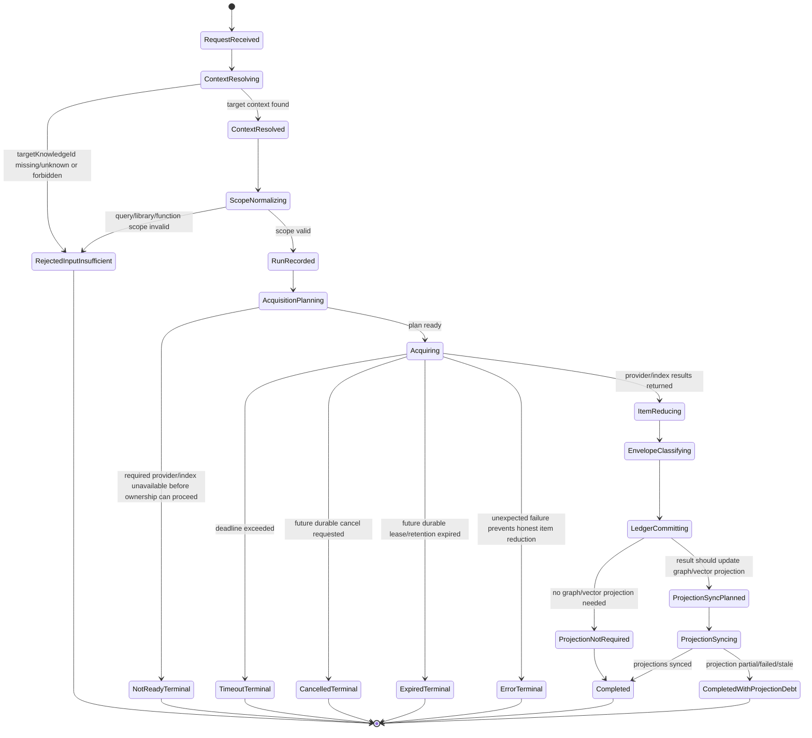

# S5 Acquisition Run Statechart

> Scope: one target-scoped S5 acquisition request, e.g. CVE lookup, threat-search, code-search, dangerous-callers.

The acquisition run lifecycle owns request acceptance, context binding, provider/index execution, terminal envelope classification, durable ledger persistence, and projection sync planning.

---

## 1. Statechart



---

## 2. Run status vs acquisition status

The run has a lifecycle status. The envelope and each item have acquisition statuses.

| Layer | Field family | Examples | Meaning |
|---|---|---|---|
| Run lifecycle | `runStatus` | `accepted`, `running`, `completed`, `completed_with_projection_debt`, `rejected`, `timeout`, `failed` | Did S5 own and finish the request lifecycle? |
| Envelope result | `acquisitionStatus` | `completed_hit`, `completed_no_hit`, `partial_hit`, `incomplete_acquisition`, `not_ready` | What did the whole request learn? |
| Item result | `itemAcquisitions[].acquisitionStatus` | same vocabulary | What happened for a library/query/function item? |
| Projection result | `projectionState.*` | `synced`, `partial`, `failed`, `stale`, `not_required` | Are derived indexes current? |

Legitimate examples:

```json
{
  "runStatus": "completed",
  "acquisitionStatus": "incomplete_acquisition",
  "consumerPolicy": "do_not_use_as_negative_evidence"
}
```

```json
{
  "runStatus": "completed_with_projection_debt",
  "acquisitionStatus": "completed_hit",
  "projectionState": {"neo4j": "synced", "qdrant": "partial"}
}
```

---

## 3. Terminal states

| Terminal state | Persisted? | Envelope expected? | S3 interpretation |
|---|---:|---:|---|
| `RejectedInputInsufficient` | Yes if enough request identity exists; otherwise request log only | Yes when possible | Caller/S3 adapter diagnostic, not evidence. |
| `NotReadyTerminal` | Yes | Yes | S5 dependency/index unavailable, not no-hit. |
| `TimeoutTerminal` | Yes | Yes if enough context exists; else timeout error | Acquisition incomplete, not no-hit. |
| `CancelledTerminal` | Future durable-control surface | Prefer yes | Caller/operator cancelled; not no-hit. |
| `ExpiredTerminal` | Future durable-control surface | Prefer yes | S5 ownership/retention expired before terminal result; not no-hit. |
| `ErrorTerminal` | Yes if envelope can be assembled; otherwise operational error log | Prefer yes | Operational failure, not no-hit. |
| `Completed` | Yes | Yes | Honest terminal envelope exists. Check acquisitionStatus and consumerPolicy. |
| `CompletedWithProjectionDebt` | Yes | Yes | Ledger result exists; graph/vector consumers must observe projection caveat. |

---

## 4. Durable ownership requirement

The durable S5 ledger should create an acquisition run row no later than `RunRecorded`:

```text
acquisitionRunId
requestId / xRequestId
surface
targetKnowledgeId
targetContextVersion
scopeHash
runStatus
createdAt
updatedAt
startedAt
completedAt
```

After `EnvelopeClassifying`, the run row must have a terminal envelope snapshot or a pointer to stored acquisition artifacts. This makes the original HTTP response replayable/auditable even if S2/S3 only stores the `acquisitionId`.

---

## 5. Response-owned compatibility

Current S5 endpoints are response-owned. The state-machine target is durable-owned. During migration:

- Existing target-scoped endpoints may keep returning direct `AcquisitionEnvelopeV1`.
- The same envelope should also be persisted in the S5 ledger.
- Later APIs can add `GET /v1/acquisitions/{acquisitionId}` or `GET /v1/target-contexts/{id}/acquisitions/{acquisitionId}` without changing S3 interpretation rules.

---

## 6. No-hit rule inside the run

`Completed` is not enough for no-hit. S5 may emit `completed_no_hit` only when:

1. the target context was resolved;
2. the item/envelope scope was explicit;
3. all required methods for that scope completed;
4. no timeout/provider error/stale-only/conflict/projection debt invalidates the relevant method;
5. `consumerPolicy` does not forbid negative evidence.

If any condition fails, the run can still complete, but acquisition status must be `incomplete_acquisition`, `partial_hit`, `stale_cache_only`, `conflicting_evidence`, `not_ready`, `timeout`, or `error` as appropriate.
