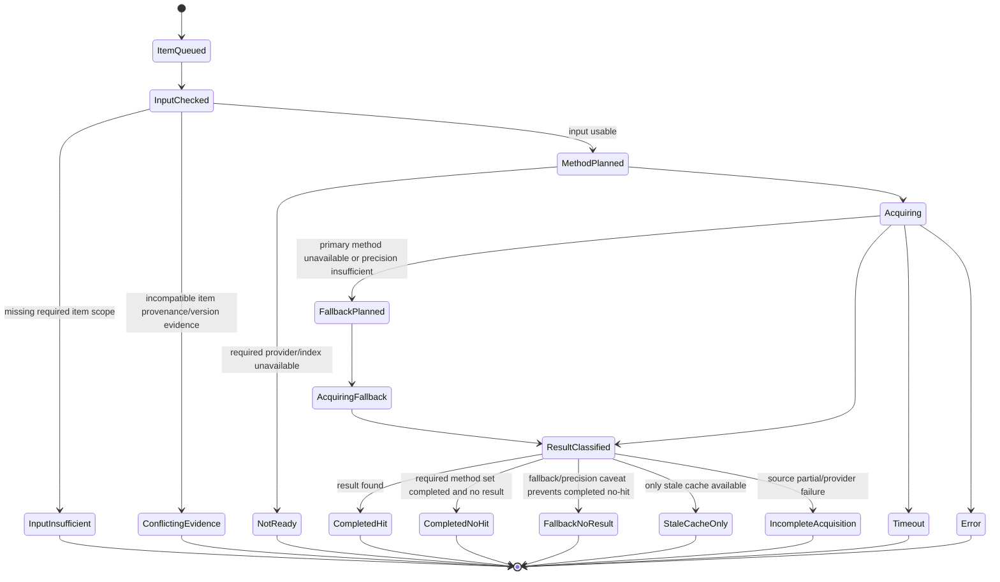

# S5 Item Acquisition Lifecycle

> Scope: one item inside `itemAcquisitions[]`: library, query, function, memory, or other future acquisition item.

Mixed batch outcomes are normal. S5 must not collapse them into a misleading top-level success/no-hit state.

---

## 1. Generic item statechart



---

## 2. Wire mapping

| Internal item state | `acquisitionStatus` | `acquisitionQualityGate` | `consumerPolicy` |
|---|---|---|---|
| `CompletedHit` | `completed_hit` | `accepted` or `accepted_with_caveats` | `contextual_only` or `s3_may_derive_local_support_if_refs_validate` |
| `CompletedNoHit` | `completed_no_hit` | `accepted` | `scoped_no_hit_record_only` |
| `FallbackNoResult` | `incomplete_acquisition` | `inconclusive` | `do_not_use_as_negative_evidence` |
| `StaleCacheOnly` | `stale_cache_only` | `accepted_with_caveats` | `do_not_use_as_negative_evidence` |
| `IncompleteAcquisition` | `incomplete_acquisition` | `inconclusive` | `do_not_use_as_negative_evidence` |
| `InputInsufficient` | `input_insufficient` | `rejected` | `do_not_use` or `do_not_use_as_negative_evidence` |
| `ConflictingEvidence` | `conflicting_evidence` | `inconclusive` or `rejected` | `do_not_use_as_negative_evidence` |
| `NotReady` | `not_ready` | `rejected` | `do_not_use_as_negative_evidence` |
| `Timeout` | `timeout` | `inconclusive` | `do_not_use_as_negative_evidence` |
| `Error` | `error` | `rejected` | `do_not_use_as_negative_evidence` |

Important: `completed_no_hit` is reserved for strict method-complete, scoped, projection-current no-result cases. Broad fallback no-result, missing precision input, partial source coverage, stale cache, timeout, and projection debt must not emit `completed_no_hit`; they must use an incomplete/caveated status and `do_not_use_as_negative_evidence`.

---

## 3. CVE item specialization

CVE item method planning should track:

```text
osv_commit
nvd_cpe
nvd_keyword
cache
epss_enrichment
kev_enrichment
```

Common transitions:

| Case | Item outcome |
|---|---|
| `commit + repoUrl` exact OSV hit | `completed_hit`, `versionMatchReason=osv_commit_match` |
| CPE version range confirms affected | `completed_hit`, `versionMatchReason=matched_nvd_cpe_range` |
| CPE range confirms outside affected range | CVE item present with `version_match=false`, S3 treats as range-out for that CVE only |
| All required precise methods complete and no CVE | `completed_no_hit`, `consumerPolicy=scoped_no_hit_record_only` |
| Keyword fallback only and no CVE | `incomplete_acquisition`, `consumerPolicy=do_not_use_as_negative_evidence`, fallback trace records keyword-only precision loss |
| Missing version / `cveLookupEligible=false` | `input_insufficient` |
| Version evidence conflict | `conflicting_evidence` |
| Provider timeout/error | `timeout` or `incomplete_acquisition` |
| Cache exists but is stale and provider unavailable | `stale_cache_only` |

---

## 4. Code/threat item specialization

| Surface | Item type | Completed hit can support | Empty/no-hit caveat |
|---|---|---|---|
| `code-search` | `query` or `function` | Local-derived support only if refs/provenance validate | No-hit depends on current Neo4j/Qdrant projection state. Projection debt forbids negative evidence. |
| `dangerous-callers` | `function` | Local-derived support if function refs attach to source/SAST evidence | Empty callers are scoped to current graph projection only. |
| `threat-search` | `query` | Contextual knowledge only | Empty threat search is scoped context, not a safety claim. |

---

## 5. Ledger shape for items

Minimum durable item record:

```text
acquisitionItemId
acquisitionRunId
itemKey
itemType
scopeHash
acquisitionStatus
acquisitionQualityGate
consumerPolicy
methodsAttempted
methodsSucceeded
fallbackTrace
diagnostics
sourceEvidenceRefs
derivedFromEvidenceRefs
resultJson
createdAt
completedAt
```

Each item must be queryable independently because S3's evidence catalog will often consume only a subset of a batch.
