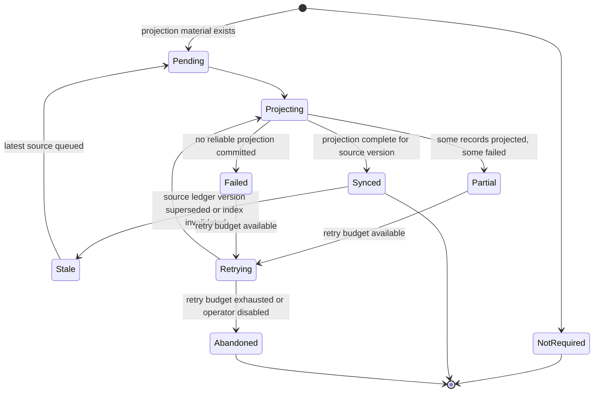

# S5 Projection Lifecycle

> Scope: derived writes from the S5 SQL ledger into Neo4j and Qdrant.

Projection state is not the same as acquisition truth. Neo4j/Qdrant can accelerate/query acquired knowledge, but the ledger remains authoritative.

---

## 1. Projection target model

S5 should track projection state per target and per projection target:

```text
projectionTarget = neo4j_threat_graph | neo4j_code_graph | qdrant_threat_vectors | qdrant_code_vectors | future_index
projectionVersion = monotonically tied to ledger source version or projection job attempt
sourceKind = target_context_version | acquisition_run | acquisition_item | threat_etl_snapshot
sourceId = ledger id / version id
```

---

## 2. Statechart



---

## 3. State definitions

| State | Meaning | S3/API consequence |
|---|---|---|
| `not_required` | Source record has no graph/vector projection need. | No caveat needed. |
| `pending` | Projection job is queued but not started. | Dependent surfaces may be `not_ready` or caveated. |
| `projecting` | Projection is in progress. | Long-running health may report progress; no-hit not safe. |
| `synced` | Projection target is current for the source version. | Dependent queries may use projection normally. |
| `partial` | Some records are projected, but not enough for complete semantics. | Empty/no-hit from dependent query is not negative evidence. |
| `failed` | Projection failed. Ledger remains authoritative. | Dependent query should be `not_ready` or `incomplete_acquisition`. |
| `stale` | Projection reflects old ledger source version. | Query results must expose stale projection caveat. |
| `retrying` | Projection retry is scheduled/running. | Health/progress only; no-hit not safe. |
| `abandoned` | Retry budget exhausted or disabled. | Manual/human/operator diagnostic; dependent surfaces gated. |

---

## 4. Projection debt vocabulary

Wire/API projection state should be compact but explicit:

```json
{
  "projectionState": {
    "neo4jCodeGraph": "synced",
    "qdrantCodeVectors": "partial",
    "neo4jThreatGraph": "synced",
    "qdrantThreatVectors": "synced",
    "projectionDebt": true,
    "diagnostics": [
      {"code": "QDRANT_CODE_VECTOR_PARTIAL", "message": "17/20 functions indexed"}
    ]
  }
}
```

Rules:

- `projectionDebt=true` must be reflected in `acquisitionQualityGate` or `consumerPolicy` for projection-dependent surfaces.
- Empty Neo4j/Qdrant query results are only meaningful when the relevant projection target is `synced` for the envelope scope.
- Projection failure must not mutate historical acquisition results. It creates projection-state records and possibly a new projection job.

---

## 5. Source-of-truth and recovery

```text
Ledger committed + projection failed => acquisition truth remains committed.
Projection synced + ledger superseded => projection becomes stale until reprojected.
Projection partial + query returns empty => do_not_use_as_negative_evidence.
```

Recovery should operate by reprocessing ledger records, not by treating Neo4j/Qdrant as authoritative input.

---

## 6. Implementation implications

Minimum durable projection tables/records:

```text
projection_jobs
projection_states
projection_attempts
```

Minimum fields:

```text
projectionJobId
sourceKind
sourceId
projectionTarget
sourceVersionHash
state
attemptCount
lastAttemptAt
lastSuccessAt
errorCode/errorMessage
projectedCount/expectedCount
```

Projection jobs should be idempotent. Re-running a job for the same sourceVersionHash and target should converge to the same projection content or replace the previous projection atomically where feasible.
