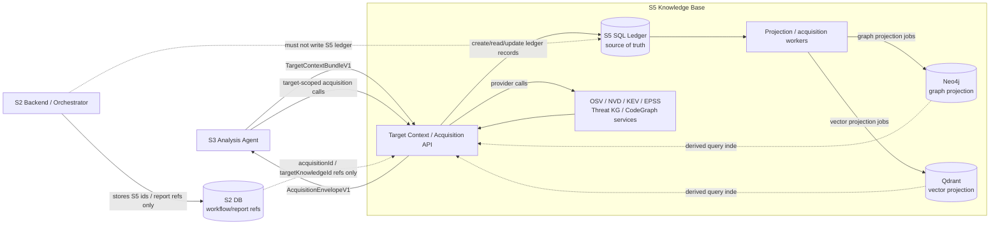

# S5 Acquisition State Machine

> Status: **draft canonical design surface**
> Owner: **S5 Knowledge Base**
> Current decision: **S5-owned SQL ledger is source of truth; Neo4j/Qdrant are projections**
> Critic verification: **PASS** on 2026-05-11 after fixing fallback no-result / `completed_no_hit` ambiguity.

This page family defines the durable state-machine contract for S5 target-aware acquisition. It is the design surface that should guide the next S5 implementation pass before choosing exact DB tables, migrations, or Neo4j/Qdrant write mechanics.

The design intentionally mirrors the S3 state-machine lesson:

```text
S5 request/run completed
!= acquisition found a vulnerability
!= no relevant knowledge exists
!= Neo4j/Qdrant projections are current
```

---

## 1. Final agreement

S5 target-aware acquisition needs three separable lifecycles:

1. **TargetContext lifecycle** — can S5 durably identify/version the target context S3 supplied?
2. **AcquisitionRun lifecycle** — can S5 execute and persist a scoped acquisition under that target context?
3. **Projection lifecycle** — did S5 project ledger facts into Neo4j/Qdrant indexes, and are those projections current?

The source-of-truth decision is:

```text
S5 SQL ledger = source of truth for target contexts, acquisition runs, item outcomes, provider observations, and projection state.
Neo4j = graph/query projection derived from the ledger.
Qdrant = vector/search projection derived from the ledger.
S2 DB = orchestration/report database, not S5 acquisition source of truth.
```

For alpha this can be SQLite behind an `AEGIS_KB_LEDGER_URL`-style seam. For production it should be Postgres or a Postgres schema owned by S5. Physical DB sharing with S2 is acceptable only if schema/migration/write ownership remains S5-only.

---

## 2. Component map



---

## 3. Two-layer S5 outcome model

### Run status

Run status answers whether S5 accepted/owned/executed the request lifecycle:

```text
received
accepted
running
completed
completed_with_projection_debt
rejected
failed
timeout
cancelled   # future durable-worker/control surface
expired     # future durable-worker/control surface
```

### Acquisition status

Acquisition status answers what S5 learned for a specific envelope/item scope:

```text
completed_hit
completed_no_hit
partial_hit
incomplete_acquisition
input_insufficient
stale_cache_only
conflicting_evidence
not_ready
timeout
error
```

These combine legitimately:

```text
runStatus=completed + acquisitionStatus=incomplete_acquisition
runStatus=completed_with_projection_debt + acquisitionStatus=completed_hit
runStatus=completed + acquisitionStatus=completed_no_hit + consumerPolicy=scoped_no_hit_record_only
```

`runStatus=completed` only means S5 persisted an honest terminal envelope. It does not imply a clean security result, a vulnerability verdict, or a current Neo4j/Qdrant projection.

### S3 consumer decision matrix

| S5 signal combination | S3 may do | S3 must not do |
|---|---|---|
| `completed_hit` + `consumerPolicy=s3_may_derive_local_support_if_refs_validate` + source/derived refs valid | Consider as derived local support after S3 ref validation | Treat as automatically accepted claim |
| `completed_hit` + `consumerPolicy=contextual_only` | Use as contextual knowledge | Use as local grounding by itself |
| `completed_no_hit` + `accepted` + `scoped_no_hit_record_only` + relevant projection state `synced` or not required | Record scoped negative acquisition attempt | Generalize to project-wide safety/no-vulnerability |
| `incomplete_acquisition`, `not_ready`, `timeout`, `error` | Record operational diagnostic / retry or caveat | Treat missing results as no-hit |
| `input_insufficient` | Treat as S3/S4 adapter/input diagnostic | Treat as S5 knowledge absence |
| `stale_cache_only` | Use as stale contextual diagnostic if explicitly allowed | Use as negative evidence |
| `conflicting_evidence` | Mark inconclusive / request review | Pick one side silently |
| Any status + `consumerPolicy=do_not_use_as_negative_evidence` | Preserve diagnostic and caveat | Use as no-hit/negative evidence |
| Any graph/vector-dependent empty result + `projectionDebt=true` | Treat projection as incomplete/stale | Treat empty result as no caller/no code/no threat |

---

## 4. Page map

1. [[wiki/canon/specs/s5-acquisition-state-machine/target-context-lifecycle|Target Context Lifecycle]] — target identity, versioning, idempotency, supersession.
2. [[wiki/canon/specs/s5-acquisition-state-machine/acquisition-run-statechart|Acquisition Run Statechart]] — request ownership, provider execution, envelope persistence.
3. [[wiki/canon/specs/s5-acquisition-state-machine/item-acquisition-lifecycle|Item Acquisition Lifecycle]] — per-library/per-query/per-function outcomes for mixed batches.
4. [[wiki/canon/specs/s5-acquisition-state-machine/projection-lifecycle|Projection Lifecycle]] — Neo4j/Qdrant projection state and debt handling.
5. [[wiki/canon/specs/s5-acquisition-state-machine/storage-ownership|Storage Ownership]] — SQL ledger vs S2 DB vs Neo4j/Qdrant responsibilities.
6. [[wiki/canon/specs/s5-acquisition-state-machine/transition-table|Transition Table]] — implementation-facing transition rows.

---

## 5. Initial invariants

1. S5 SQL ledger is the source of truth for target context versions, acquisition runs, item outcomes, provider observations, and projection states.
2. Neo4j and Qdrant are projections. They can be stale, partial, or unavailable without invalidating the ledger.
3. S2 may store S5 identifiers and report references, but must not be the source of truth for S5 acquisition state.
4. `runStatus=completed` means the S5 run has an honest persisted terminal envelope; it does not mean a vulnerability exists or does not exist.
5. `completed_no_hit` is valid only for the explicit item/envelope scope after all required methods completed.
6. `timeout`, `not_ready`, `error`, `input_insufficient`, `stale_cache_only`, `conflicting_evidence`, and projection debt are never negative security evidence.
7. Missing or stale Neo4j/Qdrant projection must be exposed as projection state/debt, not hidden behind empty search results.
8. S5 must not emit final vulnerability/security verdicts. S3 remains owner of final claim/evidence/quality outcomes.
9. Fallback is never silent; precision drops must appear in `fallbackTrace`, `diagnostics`, `consumerPolicy`, or projection state.
10. Replays and retries must be idempotent by target context identity, input hash, acquisition scope hash, and provider observation identity where feasible.

---

## 6. Current implementation note

As of 2026-05-11, S5 has a file-backed `TargetContextService` and target-scoped acquisition envelopes. That implementation is a useful v1 compatibility/bootstrap step, but it is **not yet** the durable acquisition ledger described here. The next implementation should introduce the S5-owned ledger and migrate or wrap the current JSON target-context store behind the ledger boundary.

Also on 2026-05-11, the target-scoped CVE implementation was aligned with this state-machine rule: keyword-only no-result now maps to `incomplete_acquisition` + `do_not_use_as_negative_evidence`, not `completed_no_hit`. Focused S5 target-context tests and the full S5 suite passed after the change.

S3 WR follow-up (2026-05-11): target-context acquisition implementation now also enforces the deadline/mixed-status guardrails requested by S3. Embedded codeGraph projection is deadline-aware and reports timeout/incomplete projection through the ingest envelope; target-scoped CVE provider timeout/error paths return `AcquisitionEnvelopeV1`; and aggregate `partial_hit` is emitted only when at least one item is a real `completed_hit`.
