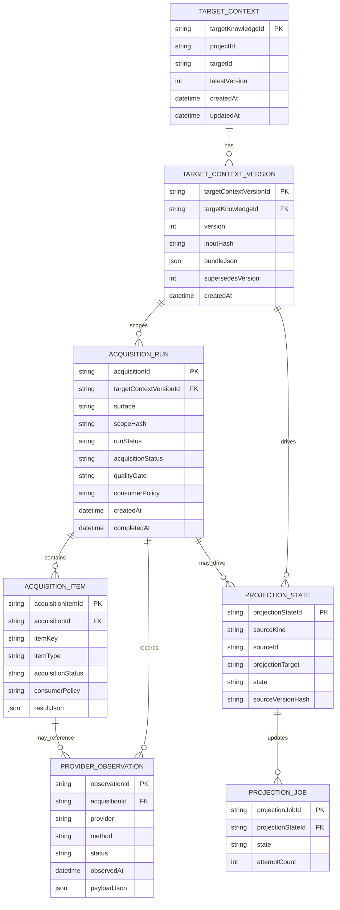

# S5 Storage Ownership

> Decision: S5 owns a durable SQL ledger. Neo4j and Qdrant are projections. S2 DB is not S5 acquisition source of truth.

---

## 1. Ownership matrix

| Store | Owner | Role | May be source of truth for acquisition? |
|---|---|---|---:|
| S5 SQL ledger | S5 | Target contexts, acquisition runs/items, provider observations, projection states | Yes |
| Neo4j | S5 | Graph projection/query index for threat/code relationships | No |
| Qdrant | S5 | Vector projection/query index for threat/code semantic search | No |
| S2 DB | S2 | Project/workflow/report/user-facing orchestration | No |
| S5 provider caches | S5 | Performance/freshness cache for external providers | No, unless copied into provider observation rows |
| Logs | Each service | Operational trace/debugging | No |

S2 may store references such as `targetKnowledgeId`, `targetContextVersion`, `acquisitionId`, and evidence/report IDs. S2 must not be required to reconstruct S5 acquisition truth.

---

## 2. Physical deployment choices

The decision is about logical ownership, not necessarily separate hardware.

Acceptable alpha option:

```text
services/knowledge-base/data/s5-ledger.sqlite
AEGIS_KB_LEDGER_URL=sqlite:///data/s5-ledger.sqlite
```

Acceptable production options:

```text
postgres database: aegis_s5_knowledge
```

or

```text
shared postgres cluster
  schema: s2_app
  schema: s5_ledger   <-- owned/migrated only by S5
```

Not acceptable:

```text
S5 acquisition rows live only in S2 application tables.
Neo4j/Qdrant are treated as authoritative historical acquisition ledgers.
JSON files remain the only durable acquisition history after alpha.
```

---

## 3. Minimal ledger entities



---

## 4. Boundary rules

### S5 ledger

- Owns `TargetContextBundleV1` normalized bundle snapshots.
- Owns `AcquisitionEnvelopeV1` terminal snapshots.
- Owns per-item status and fallback/diagnostic history.
- Owns provider observation provenance and cache freshness decisions.
- Owns projection state and retry history.

### Neo4j

- Stores graph projections of target context, code graph, threat relations, CVE/library relationships, and acquired facts when useful for graph queries.
- Must carry ledger IDs/provenance so every graph fact can trace back to ledger source.
- Must not be the only place where acquisition outcome or fallback diagnostics live.

### Qdrant

- Stores vector projections of threat/code/acquisition text embeddings where useful for semantic retrieval.
- Must include payload pointers to ledger IDs, target context version, and projection version.
- Must not decide freshness or historical truth by itself.

### S2 DB

- Stores user/project/workflow/report state.
- May store S5 refs for report traceability.
- Must call S5 API to inspect acquisition truth.

---

## 5. Migration from current implementation

Current implementation:

```text
data/target-contexts.json = target context version bootstrap store
acquisition envelopes = response-owned/transient
```

Target implementation:

```text
S5 SQL ledger stores both target context versions and acquisition envelopes/items.
Current JSON file becomes dev-only, migrated, or wrapped by a repository interface.
```

Recommended migration path:

1. Introduce `LedgerRepository` interface with SQLite implementation.
2. Move target context store behind the repository.
3. Persist every target-scoped acquisition run and item envelope.
4. Add projection state rows for Neo4j/Qdrant writes.
5. Add read APIs for acquisition history/status.
6. Retire JSON store or make it an explicit local-dev fallback only.
