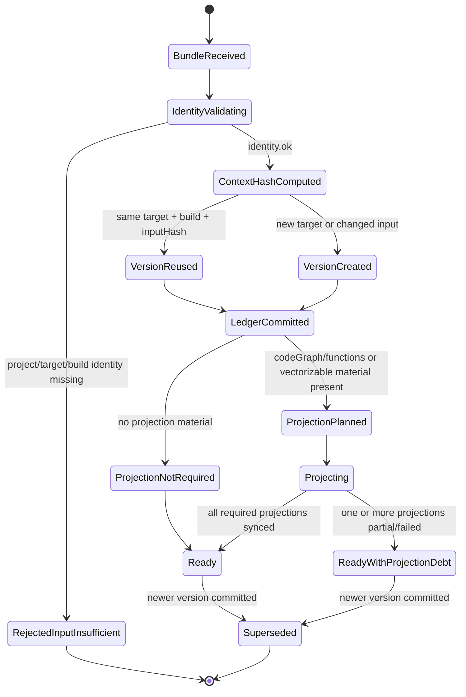

# S5 Target Context Lifecycle

> Scope: one S3-supplied `TargetContextBundleV1` under S5 ownership.

A target context is the durable identity/version anchor for all S3 target-aware S5 acquisitions. It must be stored before S3 canonical acquisition calls can safely run.

---

## 1. Statechart



---

## 2. State definitions

| State | Meaning | Storage effect | S3 meaning |
|---|---|---|---|
| `BundleReceived` | S5 received a target-context request. | May record request/audit row if requestId exists. | No target knowledge exists yet. |
| `IdentityValidating` | S5 checks project/target/build identity. | No target version committed yet. | Missing identity must not fall back to global knowledge. |
| `RejectedInputInsufficient` | Target identity is insufficient. | Optional rejection/audit record keyed by requestId/input hash; no target version. | `acquisitionStatus=input_insufficient`, `consumerPolicy=do_not_use`. |
| `ContextHashComputed` | Bundle is normalized and hashed. | `targetContextInputHash` available. | Replay/idempotency can be decided. |
| `VersionReused` | Same target/build/input hash already exists. | Existing version reused; `lastIngestedAt` updated. | `results.reused=true`. |
| `VersionCreated` | New target or changed normalized input. | New `targetContextVersion`; previous version superseded if present. | S3 should use latest version for new acquisitions. |
| `LedgerCommitted` | Target context version is durably stored in S5 SQL ledger. | Source of truth committed. | Target-scoped acquisition may proceed even if projections lag. |
| `ProjectionPlanned` | Code graph/functions or vectorizable material requires projection. | Projection jobs and projection-state rows created. | Projection debt may affect code-search/dangerous-caller usefulness. |
| `Projecting` | Neo4j/Qdrant projection work is executing. | Projection state changes over time. | Query surfaces may be `not_ready`/caveated until synced. |
| `Ready` | Target context and required projections are synced. | Target version active/current. | S5 can serve target-aware surfaces with normal caveats. |
| `ReadyWithProjectionDebt` | Ledger is committed but one or more projections failed/partial/stale. | Debt recorded per projection target. | S3 can use ledger-backed context, but graph/vector-derived no-hit is not safe. |
| `Superseded` | A newer version exists for the same target identity. | Old version remains auditable with supersession link. | Old acquisitions remain historical; new calls should bind to latest or explicit version. |

---

## 3. Identity and idempotency keys

Minimum identity required for target-aware S3 flow:

```text
projectId
AND (target.targetId OR projectId + target.path/name)
AND (provenance.buildSnapshotId OR provenance.buildUnitId OR target.buildUnitId)
```

Idempotency key family:

```text
targetKnowledgeId = deterministic(projectId, targetId)
targetContextInputHash = hash(normalized TargetContextBundleV1)
targetContextVersion = monotonic per targetKnowledgeId
same targetKnowledgeId + build identity + targetContextInputHash => VersionReused
same targetKnowledgeId + changed targetContextInputHash => VersionCreated
```

---

## 4. Projection debt rule

A target context can be `LedgerCommitted` even if Neo4j/Qdrant projection fails. This is intentional.

```text
Target context durability and projection freshness are separate concerns.
```

`ReadyWithProjectionDebt` must lower or block only the surfaces that depend on the missing projection:

| Projection debt | Affected surfaces | Consumer policy |
|---|---|---|
| Neo4j code graph debt | dangerous-callers, call-chain expansion, graph-neighbor code search | `do_not_use_as_negative_evidence` for no-hit/empty results |
| Qdrant code vector debt | vector_semantic code search, GraphRAG hybrid quality | `accepted_with_caveats` or `not_ready` depending on fallback |
| Threat KG graph/vector debt | threat-search | `not_ready` or `incomplete_acquisition`, not no-hit |

---

## 5. Required API consequences

- `POST /v1/target-contexts` may return an ingest envelope with `acquisitionStatus=completed_hit` while `projectionState.qdrant=partial` or `projectionDebt=true`; on the ingest surface, `completed_hit` only means durable target knowledge was persisted, not that a threat/CVE/security hit was found.
- If target identity is insufficient, S5 returns `input_insufficient` and **does not create a targetKnowledgeId from defaults**.
- If target context is superseded, acquisition APIs must either bind to latest by default or allow an explicit `targetContextVersion`; the chosen behavior must be visible in the envelope `scope`.
